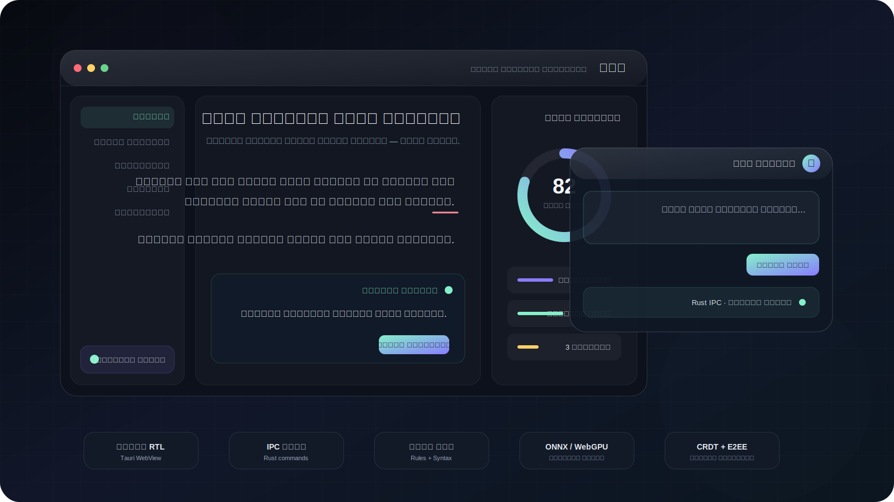
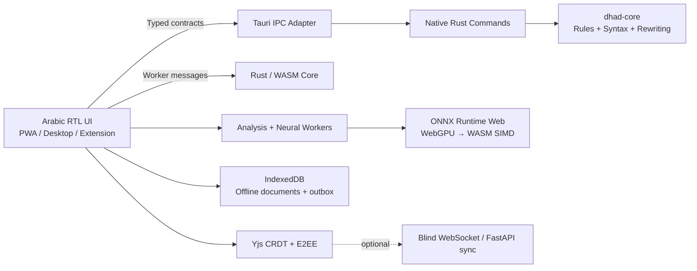

<div align="center">
  

# ضاد · Dhad Desktop

### Arabic writing intelligence that belongs on your device.
### ذكاء كتابي عربي، محلي أولاً، مصمم للخصوصية والسرعة.

[](CHANGELOG.md)
[](rust/dhad-core-rs)
[](src-tauri)
[](web_demo)
[](web_demo/neural)
[](#privacy-boundary)
[](web_demo/collaboration)
[](#desktop-builds)
[](#desktop-builds)
[](LICENSE)

**Dhad is an Arabic-first writing platform with a deterministic Rust core, WASM delivery, optional local ONNX inference, native Tauri desktop integration, document tooling, analytics and encrypted CRDT collaboration.**

[Quickstart](#quickstart) · [Architecture](#architecture) · [Desktop builds](#desktop-builds) · [Security](SECURITY.md) · [Contributing](CONTRIBUTING.md)
</div>

---

## The product

Dhad combines a full writing surface with an embeddable language engine. The default analysis path runs locally. The desktop application adds native file dialogs, system tray controls, global shortcuts and a floating Raycast-style assistant without turning the WebView into a broadly privileged shell.

| Surface | What it provides |
|---|---|
| **Writing Intelligence** | Spelling, deterministic rules, morphology, syntax, dialect, style, tone, diacritics, semantics and consistency |
| **Rewriting** | Formal, concise, expanded, creative and academic alternatives with explicit changes and conservative meaning preservation |
| **Documents** | TXT, Markdown and DOCX import/export, bounded native file bridges and print-to-PDF workflow |
| **Analytics** | Readability, sentence insights, vocabulary, tone balance, engagement and local trends |
| **Desktop** | macOS DMG, Windows NSIS/MSI, system tray, global hotkey, native dialogs and floating assistant |
| **Platform** | Python SDK, CLI, REST/FastAPI, LSP, PWA, browser extension, Rust/WASM core and collaboration transport |

## Why Dhad

Dhad is not a skin around a remote text API. Its architecture starts with an Arabic-specific engine that can run without a network connection and exposes the same core concepts across desktop, browser and server surfaces.

### Product positioning

This matrix describes architectural emphasis, not a claim that every product has identical scope or pricing.

| Product | Recognized strength | Dhad’s differentiator |
|---|---|---|
| **Grammarly** | Broad cross-application writing assistance and mature English-centric workflow | Arabic-first linguistic stack with a fully local default analysis path |
| **LanguageTool** | Multilingual grammar ecosystem and broad integrations | Deeper Arabic layers, unified Rust/WASM core and local neural runtime assets |
| **Wordtune** | Rewriting, paraphrasing and summarization experience | Conservative offline rewriting with transparent changes and deterministic fallbacks |
| **Dhad** | Arabic writing intelligence across desktop, PWA, SDK, API and LSP | Privacy boundary controlled by the user, open architecture and native/offline deployment |

## Floating assistant

Press **⌥ Space** on macOS or **Alt Space** on Windows. When the operating system reserves the primary shortcut, Dhad registers **Ctrl + Alt + Space** as a fallback.

The assistant is:

- frameless, always-on-top and re-centered on activation;
- Mica-enabled on supported Windows systems and HUD-material enabled on macOS;
- IME-aware for Arabic composition;
- keyboard accessible and adaptive to reduced motion and high contrast;
- connected directly to native Rust commands without a network round trip.

## Architecture



### Runtime boundaries

```text
┌──────────────────────────── Local device ────────────────────────────┐
│  Editor / Mini Assistant                                             │
│      │                                                               │
│      ├── Web Worker ── Rust WASM rules and analysis                  │
│      ├── Web Worker ── ONNX WebGPU/WASM inference (optional)         │
│      ├── Tauri IPC ─── Rust native analysis, rewrite and file bridge │
│      └── IndexedDB ─── documents, preferences, history and outbox    │
└───────────────────────────────────────────────────────────────────────┘
                         │ optional encrypted updates only
                         ▼
                CRDT synchronization service
```

## Privacy boundary

- **Default:** text processing is local.
- **CSP:** production WebViews use an explicit allowlist and block arbitrary object/frame loading.
- **Least privilege:** editor and mini-assistant use separate Tauri capability files.
- **Isolation:** cross-origin opener/embedder policies support isolated worker execution.
- **No silent cloud fallback:** optional collaboration/server paths are distinct from local analysis.
- **Bounded native I/O:** desktop document reads and writes enforce a 64 MiB safety ceiling.
- **Staged export:** native exports write and sync a sibling temporary file before commit.

“Offline-first” describes the default product path. Network-enabled collaboration, server APIs and web deployment remain optional features and should be configured according to the deployment’s threat model.

## Quickstart

### Python engine

```bash
python -m venv .venv && source .venv/bin/activate && pip install -e . && dhad check "هاذا نص عربي"
```

### Web/PWA

```bash
npm ci --prefix web_demo && python -m http.server 8080 --directory web_demo
```

Open `http://localhost:8080`.

### Rust tests

```bash
cargo test --workspace --locked
```

## Desktop builds

### macOS — one line

```bash
./scripts/build-desktop.sh
```

Produces a DMG under `target/*/release/bundle/dmg/` or `target/release/bundle/dmg/`.

### Windows — one line

```bat
scripts\build-desktop.bat
```

Produces NSIS `.exe` and WiX `.msi` installers under `target\release\bundle\`.

### Build pipeline

Each desktop build script performs:

1. isolated Python tooling setup;
2. ONNX asset optimization and manifest verification;
3. Gold Master and Sovereign release audits;
4. JavaScript syntax checks and Node tests;
5. Rust formatting, Clippy and workspace tests;
6. native Tauri bundle generation.

Useful controls:

```text
DHAD_BUNDLES=dmg|nsis,msi
DHAD_SKIP_WEB_TESTS=1
DHAD_SKIP_RUST_TESTS=1
DHAD_SKIP_CLI_INSTALL=1
```

## Repository map

```text
src/dhad/                 Python reference engine, API, LSP and server surfaces
rust/dhad-core-rs/        Deterministic portable Rust core
src-tauri/                Tauri 2 native shell, commands, tray and installers
web_demo/                 PWA/editor, workers, local neural runtime and assets
extension/                Browser extension integration
benchmarks/               Regression datasets and profiling tools
tests/                    Python integration and contract tests
tools/                    Build, audit, corpus and release utilities
docs/                     Product specifications and release reports
```

## Verification

```bash
python tools/validate_desktop_release.py --root . --strict
python tools/validate_sovereign_release.py --root . --strict --write-report
npm run check --prefix web_demo
npm test --prefix web_demo
python -m pytest -q
cargo fmt --all -- --check
cargo clippy --workspace --all-targets --locked -- -D warnings
cargo test --workspace --locked
```

The repository intentionally distinguishes three evidence levels:

- **contract test:** verifies behavior and integration assumptions;
- **benchmark:** measures a defined workload on a defined machine;
- **SLA:** requires production telemetry and is not inferred from a microbenchmark.

## Release engineering

The desktop release workflow builds:

- macOS Apple Silicon DMG;
- macOS Intel DMG;
- Windows x64 NSIS installer;
- Windows x64 MSI installer.

Installer assets, icons, desktop shortcuts, cleanup hooks and upgrade identity are version-controlled under `src-tauri/`.

## Governance

- License: [AGPL-3.0-or-later](LICENSE)
- Security policy: [SECURITY.md](SECURITY.md)
- Contribution guide: [CONTRIBUTING.md](CONTRIBUTING.md)
- Code of conduct: [CODE_OF_CONDUCT.md](CODE_OF_CONDUCT.md)
- Transformation specification: [docs/MASTER_TRANSFORMATION_SPEC.md](docs/MASTER_TRANSFORMATION_SPEC.md)

---

<div align="center">
  <strong>ضاد — لأن أفضل أدوات العربية يجب أن تحترم العربية وخصوصية كاتبها.</strong>
</div>
